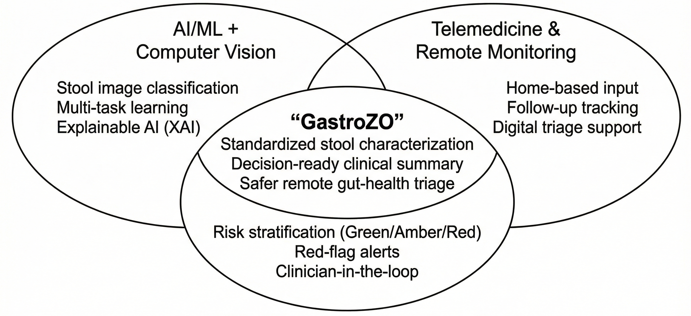
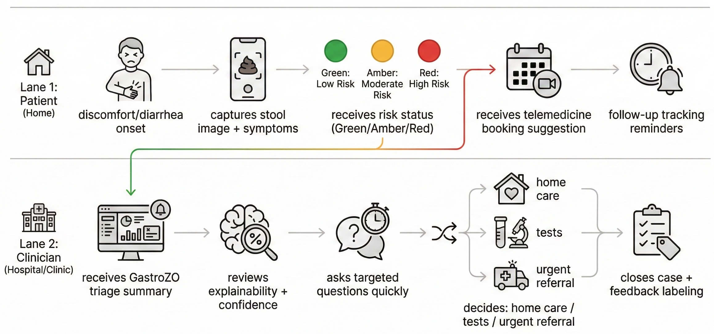

# GastroZO — AI-assisted Stool Characterization and Gut Risk Triage  
**AI x MedTech: Startup Hackathon & Cohort 2025**

GastroZO is a research-oriented AI clinical decision support (CDS) prototype designed to standardize stool characterization using patient-provided stool images and symptom context. It outputs a Bristol stool type prediction, visual indicators (color/abnormality flags), and an interpretable triage risk level (Green / Amber / Red). The system further generates a clinician-ready structured summary to improve telemedicine decision-making, reduce subjective reporting errors, and support safer follow-up monitoring.

Unlike general gut-health trackers, GastroZO is built with a clinical workflow-first design: data acquisition → quality checks → AI inference → risk scoring → clinician summary → feedback loop. The focus is not to replace clinicians, but to assist faster triage and escalation while keeping safety guardrails and privacy-by-design as first-class requirements.

---

## Table of Contents
1. [Problem Statement](#problem-statement)
2. [Why Existing Solutions Fail](#why-existing-solutions-fail)
3. [Our Solution: GastroZO](#our-solution-gastrozo)
4. [Key Innovations](#key-innovations)
5. [Hackathon Theme Alignment](#hackathon-theme-alignment)
6. [End-to-End Workflow](#end-to-end-workflow)
7. [System Architecture](#system-architecture)
8. [AI Methodology](#ai-methodology)
9. [Dataset Strategy & Preprocessing](#dataset-strategy--preprocessing)
10. [Risk Stratification Logic](#risk-stratification-logic)
11. [MVP Prototype (Patient + Clinician Flows)](#mvp-prototype-patient--clinician-flows)
12. [Clinical Safety, Ethics & Privacy](#clinical-safety-ethics--privacy)
13. [Results & Observations](#results--observations)
14. [Evaluation Tables](#evaluation-tables)
15. [Roadmap & Pilot Plan](#roadmap--pilot-plan)
16. [Business Model](#business-model)
17. [Business Model + Roadmap Visualization](#business-model--roadmap-visualization)

---

## Problem Statement

Gastrointestinal symptoms such as diarrhea, constipation, abdominal discomfort, irregular bowel movement frequency, and suspected gut infections contribute significantly to outpatient consultations and telemedicine follow-ups. However, remote gut-health triage is still unreliable, primarily due to the absence of standardized stool reporting in home environments.

In typical teleconsultation workflows, stool information is captured through subjective patient descriptions such as “loose”, “hard”, or “watery”. This creates clinical uncertainty, increases repeated questioning, delays escalation decisions, and reduces the quality of remote monitoring. Furthermore, potential red flags such as suspected bleeding indicators or severe dehydration risk are often not reliably communicated early.

### Core Challenges (Clinical + Operational)
- Subjective and inconsistent stool descriptions across patients  
- Low compliance with manual stool diaries and symptom tracking  
- Lack of clinical standardization in most telemedicine platforms  
- Delayed escalation when red flags are not highlighted early  
- High workload for clinicians due to repetitive patient interrogation  

### Why It Matters
Even when a case is non-emergency, lack of structure leads to:
- avoidable patient anxiety  
- unnecessary repeated consultations  
- delayed investigations (tests/imaging)  
- reduced trust in telemedicine outcomes  

---

## Why Existing Solutions Fail

Current tools fail in gut triage primarily because they are not designed as clinician-grade decision support systems.

### Gaps in Current Practice
- Most wellness apps focus on general health tracking, not risk triage  
- Stool reports are rarely standardized into interpretable scales (e.g., Bristol)  
- There is no robust image quality gating, so inaccurate inputs dominate outcomes  
- Many systems lack explainability cues for clinician trust and adoption  
- Almost no solution integrates a triage-ready summary for a doctor dashboard  

### Limitation Visualization

---

## Our Solution: GastroZO

GastroZO standardizes stool reporting and converts it into decision-ready outputs for telemedicine and OPD-style fast triage.

### Proposed Solution Understanding Visualization

### Pipeline Workflow Automation Diagram

In simple terms:

> GastroZO transforms an unstructured stool image + symptoms into a structured clinical triage report.

---

## Key Innovations

### Standardized Stool Characterization
GastroZO outputs a standardized stool profile aligned with clinical communication patterns:
- Bristol stool type (1–7)  
- stool color class  
- abnormality suspicion flags (mucus/blood cues)  

### Multi-Modal Risk Stratification
The system does not rely on images alone. It combines:
- stool appearance patterns  
- symptom severity and duration  
- red-flag symptoms  
to produce a risk level aligned with triage decision-making.

### Clinician-First Summary Generation
Instead of providing just a prediction, GastroZO produces:
- a structured overview for rapid decision-making  
- a triage recommendation output  
- confidence score and cues to reduce ambiguity  

### Safety Guardrails and Quality Gating
To prevent unsafe outputs:
- low-quality images are flagged/rejected  
- uncertain predictions trigger conservative guidance  
- red-flag symptom patterns trigger escalation suggestions  

### Privacy-by-Design
- explicit consent workflow  
- minimal data capture policy  
- metadata stripping (EXIF removal)  
- secure storage and controlled access  

---

## Hackathon Theme Alignment

Primary category: Telemedicine and AI Clinical Decision Support  
GastroZO is built specifically for remote assessment and clinician decision support.

Secondary alignment:
- AI in HealthTech Innovation  
- Health IT Systems and Healthcare Data Privacy  

---

## End-to-End Workflow

The GastroZO workflow is designed for fast deployment and clinical usability:

1. Patient Input  
   - stool image capture or upload  
   - structured symptom form  
   - duration and basic context (optional vitals)  

2. Quality Gate and Preprocessing  
   - blur detection  
   - illumination and noise checks  
   - normalization and resizing  
   - privacy filtering (metadata removal)  

3. AI Inference  
   - Bristol scale classification  
   - stool feature extraction  
   - color and abnormality flags  

4. Risk Stratification  
   - risk grouping: Green / Amber / Red  
   - confidence scoring and safety thresholds  

5. Clinician Summary  
   - short structured clinical report  
   - next-step recommendation  
   - high-risk alert cues  

6. Clinician Feedback Loop (Optional)  
   - clinician validation labels  
   - continuous improvement readiness  

---

## System Architecture

GastroZO uses a modular architecture enabling expansion from MVP to pilot-stage deployment.

### Architecture Blocks
- Patient Interface (Mobile/Web)  
  - capture/upload stool image  
  - symptom data collection  
  - consent and disclaimers  

- AI Processing Layer  
  - quality control gate  
  - preprocessing pipeline  
  - multi-task classification model  

- Risk Engine  
  - rule-assisted scoring  
  - confidence-based escalation  
  - red flag detection  

- Clinician Dashboard  
  - triage queue (Green/Amber/Red tags)  
  - structured summaries  
  - action logging  

- Secure Storage  
  - encrypted data storage  
  - access control  
  - audit logs  

### Architecture Diagram

### Architecture Pipeline Diagram

Descriptive note: This architecture illustrates the complete patient-to-clinician workflow. It highlights data acquisition, preprocessing and gating, AI inference, triage scoring, clinician output generation, and a feedback loop for calibration and clinical validation.

---

## AI Methodology

GastroZO follows a multi-task learning approach optimized for clinical interpretability.

### Model Approach (High-Level)
- Image Encoder  
  - CNN / Vision Transformer backbone  
  - outputs robust feature embeddings  

- Symptom Encoder  
  - lightweight tabular model (MLP)  
  - encodes symptom features such as duration, frequency, pain level, dehydration indicators  

- Fusion Layer  
  - concatenation/attention fusion  
  - creates unified patient state representation  

- Prediction Heads  
  1. Bristol score classification (1–7)  
  2. color class prediction  
  3. abnormality flag detection  
  4. risk stratification output (Green/Amber/Red)  

### AI Methodology Diagram

Descriptive note: This diagram demonstrates the multi-modal fusion pipeline and how the model’s outputs feed into the risk engine and clinician decision support summary generation.

---

## Dataset Strategy & Preprocessing

A strong preprocessing strategy ensures stable and reliable inference even in home environments.

### Dataset Strategy (Prototype to Clinical)
- Phase 1: Prototype Development  
  - controlled sample images  
  - synthetic scenarios and demonstrations  
  - focus on system pipeline correctness  

- Phase 2: Robustness and Generalization  
  - diverse lighting conditions  
  - device variations (camera quality differences)  
  - augmentation and quality gating improvements  

- Phase 3: Clinical Validation  
  - clinician consensus labeling  
  - calibration and threshold tuning  
  - bias monitoring and reporting  

### Preprocessing Pipeline
- resize and normalize  
- blur/noise detection  
- illumination correction  
- cropping/ROI normalization (optional)  
- EXIF removal  
- quality gating based on threshold score  

### Dataset and Preprocessing Diagram

Descriptive note: This pipeline figure outlines how GastroZO prepares images for inference and training. It ensures low-quality samples are filtered, improving reliability and reducing unsafe outputs.

---

## Risk Stratification Logic

GastroZO produces a triage-level decision support output, not a diagnosis.

### Risk Levels
- Green: routine monitoring likely sufficient  
- Amber: consultation recommended (non-emergency but needs review)  
- Red: urgent attention suggested, possible escalation required  

### High-Level Risk Engine Inputs
- Bristol stool type (extremes more concerning)  
- color class abnormalities (black/red suspected)  
- symptom severity and duration  
- red flag responses (dehydration, fever, persistent blood suspicion)  
- confidence score  

### Risk Logic Table (Simplified)
| Input Indicators | Risk | Suggested Next Step |
|---|---|---|
| normal patterns and mild symptoms | Green | home monitoring and hydration guidance |
| moderate abnormalities or prolonged symptoms | Amber | teleconsult and tests if needed |
| red-flag cues or high-risk prediction | Red | urgent referral or emergency guidance |

---

## MVP Prototype (Patient + Clinician Flows)

The MVP focuses on real usability and hackathon-level demo readiness.

### Patient-Side MVP
- stool image capture/upload  
- symptom collection (structured)  
- output display:
  - stool type and indicators  
  - risk level tag  
  - safe next steps (non-diagnostic)  

### Clinician-Side MVP
- triage queue with risk tags  
- structured summary view  
- confidence score and reasoning cues  
- option to confirm/correct label  

### MVP Application UI Flow Diagram

Descriptive note: This illustration shows the end-user application workflow from patient capture to AI results to clinician triage queue, ensuring a complete demo-ready product flow.

---

## Clinical Safety, Ethics & Privacy

GastroZO prioritizes patient safety and responsible AI use.

### Clinical Safety Controls
- image quality rejection to prevent incorrect inference  
- confidence thresholding for uncertain outputs  
- explicit messaging: not a diagnosis  
- red-flag escalation guidance for urgent patterns  
- clinician-in-the-loop design for final decision authority  

### Privacy Controls
- consent-first onboarding  
- minimal data capture and retention policy  
- encryption at rest and in transit (pilot stage)  
- role-based access control for clinician dashboard  
- audit logs for traceability and accountability  

---

## Results & Observations

### Prototype-Stage Outcome Summary
During hackathon-stage testing with controlled sample scenarios, the system demonstrated promising outcomes:

- improved stool reporting consistency by converting subjective descriptors into standardized outputs  
- triage categorization reduced ambiguity and supported faster teleconsultation decision-making  
- quality gating prevented unreliable inferences from blurred/low-light samples  
- risk stratification improved when combined with symptom-based red-flag indicators  
- clinician summary improved interpretability and reduced follow-up questioning overhead  

Note: These are prototype-stage observations and require clinical validation before real-world deployment.

### Result Snapshot Table (Prototype Template)
| Component | Observation | Outcome |
|---|---|---|
| image QC gate | rejected low-light images | reduced unsafe outputs |
| stool type prediction | stable on clean inputs | improved standardization |
| risk engine | strong with symptom fusion | better triage signal |
| clinician summary | faster review | reduced cognitive load |
| workflow completion | smooth patient-to-doctor path | demo-ready MVP |

---

## Evaluation Tables

### Table 1 — Output Definitions
| Output | Type | Example Values | Clinical Use |
|---|---|---|---|
| Bristol type | Multi-class | 1–7 | standardized consistency |
| color class | Multi-class | normal/pale/dark/red-suspected | abnormality cue |
| abnormality flag | Binary | mucus/blood suspected | risk assistance |
| risk level | Multi-class | Green/Amber/Red | triage prioritization |
| confidence | Continuous | 0.00–1.00 | safety gating |

### Table 2 — Recommended Metrics (Clinical + ML)
| Metric | Why It Matters | Priority |
|---|---|---|
| recall (Red risk) | avoid missing urgent cases | Highest |
| precision (Red risk) | reduce false alarms | High |
| macro F1 | balanced performance | Medium |
| calibration | confidence reliability | High |
| confusion matrix | failure analysis | High |

### Table 3 — Clinical Validation Plan (Pilot Template)
| Validation Step | Method | Expected Output |
|---|---|---|
| clinician label review | consensus labeling | gold standard dataset |
| threshold tuning | calibration curve | safe triage cutoffs |
| workflow testing | OPD/telemedicine run | usability proof |
| monitoring | drift and OOD checks | reliability tracking |

---

## Roadmap & Pilot Plan

### Hackathon MVP (0–2 Weeks)
- UI and inference pipeline  
- Bristol and risk engine integration  
- structured summary output  

### Cohort MVP Build (Month 1–2)
- clinician dashboard enhancement  
- data logging and audit trail  
- stronger preprocessing and thresholds  

### Clinical Validation (Month 3–4)
- clinician consensus labeling  
- evaluation and calibration  
- bias analysis and improvements  

### Pilot Deployment (Month 5–6)
- OPD/telemedicine pilot integration  
- real adoption metrics  
- investor readiness outcomes  

---

## Business Model

GastroZO is positioned as a scalable clinical decision-support layer for remote gut-health triage.

### Target Customers
- telemedicine platforms  
- OPD-based clinics  
- hospitals managing high-volume follow-ups  

### Revenue Model
- SaaS subscription per clinic/hospital  
- per-provider licensing  
- paid pilot and enterprise expansion  

### Deployment Advantage
- modular API-based architecture  
- clinician-friendly structured outputs  
- safety and privacy by design  

---

## Business Model + Roadmap Visualization

---
